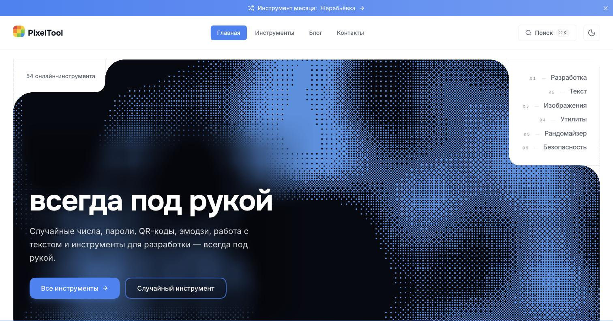

<div align="center">

#  PixelTool

**Всё нужное под рукой**

54 бесплатных онлайн-инструмента для повседневных и рабочих задач — прямо в
браузере, без установки и регистрации.

<a href="https://pixeltool.pro"></a>
<a href="https://github.com/goosen-x/pixeltool/blob/main/LICENSE"></a>
<a href="https://github.com/goosen-x/pixeltool/releases"></a>

[Все инструменты](https://pixeltool.pro/tools) ·
[Блог](https://pixeltool.pro/blog)



</div>

## Что это

Под каждую мелкую задачу — сгенерировать QR-код, посчитать проценты, сжать JSON,
выбрать случайное число — обычно приходится гуглить отдельный сайт и продираться
через рекламу. PixelTool держит такие инструменты в одном месте и открывает их
мгновенно: ничего не устанавливать, никуда не регистрироваться, файлы не
покидают браузер.

- **Разработка** — форматтеры, генераторы CSS, JWT, regex, favicon
- **Текст** — счётчики, сравнение текстов, эмодзи, ASCII-арт
- **Изображения** — сжатие, удаление фона, конвертация
- **Рандомайзер** — случайные числа, жеребьёвка, кубик
- **Безопасность** — пароли, UUID, base64
- **Здоровье** — калькуляторы вроде ИМТ
- **Утилиты** — таймеры, конвертеры единиц и по мелочи

## Запуск проекта

Нужны Node.js 20+ и pnpm.

```bash
git clone https://github.com/goosen-x/pixeltool
cd pixeltool
pnpm install

cp .env.example .env.local
# заполнить переменные — см. комментарии в .env.example

pnpm dev
```

Откройте [http://localhost:3000](http://localhost:3000).

Полезные команды:

```bash
pnpm build       # production-сборка
pnpm test        # тесты (Vitest)
pnpm typecheck   # проверка типов
pnpm lint        # ESLint
pnpm check:all   # все проверки разом
```

Подробнее — в [`/docs`](docs/README.md), включая
[руководство по созданию нового инструмента](docs/guides/WIDGET_CREATION_GUIDE.md).

## Участие в разработке

Открыт для issues и pull request'ов — нашли баг, есть идея для инструмента или
предложение по коду, welcome.

## Контакты

Дмитрий Борисенко —
[dmitryborisenko.msk@gmail.com](mailto:dmitryborisenko.msk@gmail.com)

## Лицензия

[MIT](LICENSE)
